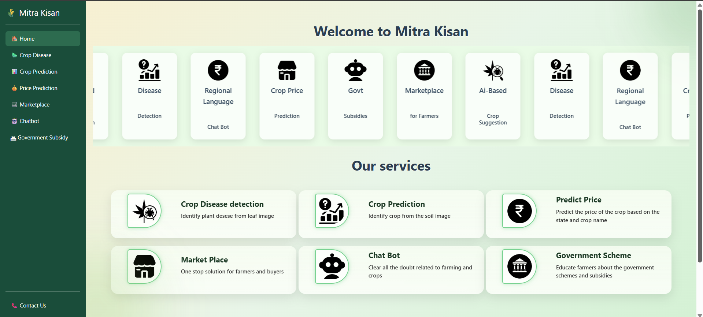

# 🌾 Mitra Kisan – A Smart GenAI Farming Assistant

## 🎯 About the Project

**Mitra Kisan** is an AI-powered agricultural assistant designed to empower farmers with modern technology.
It bridges the gap between traditional farming and smart digital solutions by providing real-time insights, recommendations, and support.

🎥 **Live Demo:**
-------


## 🖼️ Application Preview

<p align="center">
  
</p>

## 🌟 Key Benefits

* 🤖 **AI-Powered Insights** – Smart crop and price predictions
* 🛒 **Market Access** – Direct marketplace for farmers
* 🌱 **Smart Farming** – Disease detection & soil analysis
* 🏛️ **Government Support (Upcoming)** – Subsidy and scheme access

---

## ✨ Features

### 🔹 AI Solutions

* 🧠 **Price Prediction** – Market trend forecasting
* 🤖 **Smart Chatbot** – Farmer assistance & guidance
* 🌱 **Crop Recommendation** – Soil-based suggestions
* 🦠 **Disease Detection** – 50+ crop diseases detection using images

---

### 🛒 Marketplace

* Product listing with real-time updates
* State-wise pricing
* Search & filter functionality
* Fully responsive UI

---

### 📊 Dashboard

* Interactive data visualization
* Price trend analysis
* Regional insights
* Clean & user-friendly interface

---

## 🛠️ Tech Stack

**Frontend:**
React.js, HTML5, CSS3, Bootstrap, JavaScript, Axios

**Backend:**
Node.js, Express.js, Python

**Database:**
MySQL (XAMPP)

**AI/ML:**
TensorFlow, Keras, NLP

---

## 🚀 Getting Started

### 🔧 Prerequisites

* Node.js (v16+)
* Python (v3.8+)
* MySQL
* Git

---

### 📥 Installation

#### 1️⃣ Clone the repository

```bash
git clone https://github.com/muskan-am/Mitra-Kisan-.git
cd Mitra-Kisan-
```

---

#### 2️⃣ Run Backend

```bash
cd Backend
npm install
node server.js
```

---

#### 3️⃣ Run Python Server

```bash
cd Backend
pip install -r requirement.txt
python server.py
```

---

#### 4️⃣ Run Frontend

```bash
cd Frontend/Mitra_Kisan
npm install
npm run dev
```

---

## ⚙️ Environment Configuration

Create `.env` file inside **Backend/**:

```env
DB_HOST=localhost
DB_USER=root
DB_PASSWORD=
DB_NAME=Farmers
```

---

## 🗄️ Database Setup

```sql
CREATE DATABASE farmers;
USE farmers;

CREATE TABLE crop_prices (
  id INT AUTO_INCREMENT PRIMARY KEY,
  crop_name VARCHAR(100),
  state VARCHAR(100),
  price DECIMAL(10,2),
  created_at TIMESTAMP DEFAULT CURRENT_TIMESTAMP
);

CREATE TABLE marketplace (
  id INT AUTO_INCREMENT PRIMARY KEY,
  product VARCHAR(100),
  price DECIMAL(10,2),
  state VARCHAR(100),
  created_at TIMESTAMP DEFAULT CURRENT_TIMESTAMP
);
```

---

## 🌐 Access URLs

* Frontend → http://localhost:3000
* Backend → http://localhost:5000
* Python Server → http://localhost:5001

---

## 📊 Version History

### 🚀 Version 1.0.0 (Current)

* ✅ AI Price Prediction
* ✅ Disease Detection (50+ diseases)
* ✅ Crop Recommendation
* ✅ Marketplace
* ✅ Chatbot
* 🏛️ Government schemes integration

---

### 🔮 Version 2.0.0 (Upcoming)

* 🌍 Multi-language support
* 💊 Disease cure suggestions
* 🤖 Advanced chatbot
* 🔐 User authentication
* Voice assistant

---

## 🤖 AI Models Overview

### 🌱 Crop Prediction

* Classifies soil types using image data
* Built with TensorFlow & Keras
* Helps farmers identify soil visually

---

### 🦠 Crop Disease Detection

* Detects plant diseases using leaf images
* Uses CNN (Convolutional Neural Networks)
* Trained on large labeled datasets

---

### 📈 Price Prediction

* Based on historical data
* Future scope: ML-based prediction models

---

## 👩‍💻 Author

**Muskan Kesharwani**
Final Year B.Tech Student

---

## ⭐ Show Your Support

If you like this project, please ⭐ star the repository!

